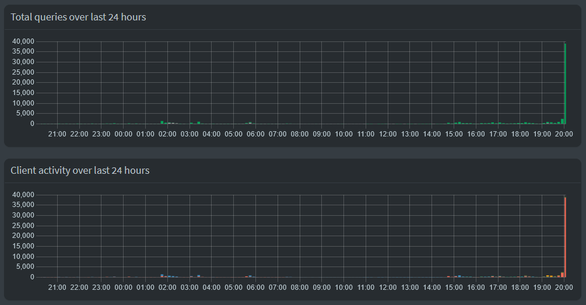

# Pi-hole Stress Test Toolkit

This toolkit is designed to assess the performance and capacity of a Pi-hole server by generating a large number of DNS requests. It includes two methods for executing the test: a PowerShell script for advanced users and a batch file for beginners.

## Components

- `pihole-stress-test-en.ps1`: A PowerShell script for sending DNS queries to a Pi-hole server (English).
- `pihole-stress-test-nl.ps1`: The same PowerShell script, but in Dutch.
- `StartPiHoleTest-en.bat`: A batch file for Windows that provides an interactive experience, ideal for beginners (English).
- `StartPiHoleTest-nl.bat`: The same batch file for Windows, but in Dutch.
- `pihole_stress_test_en.sh`: A Bash script for Linux users to perform the stress test (English).
- `pihole_stress_test_nl.sh`: The same Bash script for Linux users, but in Dutch.

## Usage
### For Advanced Users (PowerShell Script)
1. Download `pihole-stress-test-en.ps1` or `pihole-stress-test-nl.ps1`.
2. Open PowerShell and navigate to the script's location.
3. Run the script with parameters: 
   ```powershell
   .\pihole-stress-test.ps1 -PiHoleIP "your_pihole_ip" -QueryCount desired_number_of_queries -Delay desired_delay
    ```
Replace your_pihole_ip, desired_number_of_queries, and desired_delay with your specific values.

### For Beginners (Batch File)
1. Download pihole-stress-test-en.ps1 or pihole-stress-test-nl.ps1 and the corresponding .bat file.
2. Run the .bat file.
3. Enter the Pi-hole IP address, number of queries, and delay between queries when prompted.
4. The script will execute and start sending DNS queries to your Pi-hole server.

## For Linux Users
### Bash Script
1. Download pihole_stress_test_en.sh or pihole_stress_test_nl.sh.
2. Make the script executable with chmod +x pihole_stress_test.sh.
3. Run the script with ./pihole_stress_test.sh and follow the prompts.

### Parameters Explanation
- PiHoleIP: The IP address of your Pi-hole server.
- QueryCount: The total number of DNS requests to be sent.
- Delay: The delay (in milliseconds) between each DNS request.

### Pi-hole Performance During Stress Test
Below is a graphical representation showing the impact of the stress test on the Pi-hole server:

- `pihole-queries-chart.png`: This chart displays the total number of DNS queries processed by the Pi-hole server over the last 24 hours. A significant spike can be observed, which corresponds to the period when the stress test was executed.



These charts can help in understanding the capabilities and limitations of your Pi-hole server under high load conditions.

### Warning
Use this toolkit responsibly. It is intended for testing purposes only and should not be used on networks without proper authorization.

### Contributions
Contributions are welcome. Feel free to fork, modify, and make pull requests.

### License
MIT License

### Support and Contact
For support, please open an issue on the GitHub page. For direct inquiries, please contact [Your Contact Information].

### Acknowledgements
- The Pi-hole project: https://pi-hole.net